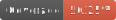

 

# ReadApp - frontend

## Entrega #1

Maquetación de la App en HTML y CSS para web (>769 px), tablet (401px-768px) y celular (<400px). 

Pantallas: 
* Login:
* Búsqueda principal
* Mis recomendaciones
* Detalle de recomendación:
* Edición de recomendación
* Búsqueda de libros
* Perfil de usuario:
    *  Información
    *  Usuarios
    *  Libros leídos
    *  Libros a leer
    *  Recomendaciones a valorar
