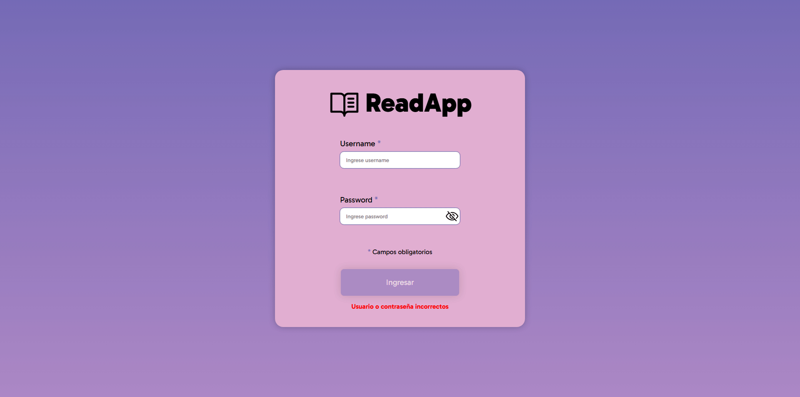
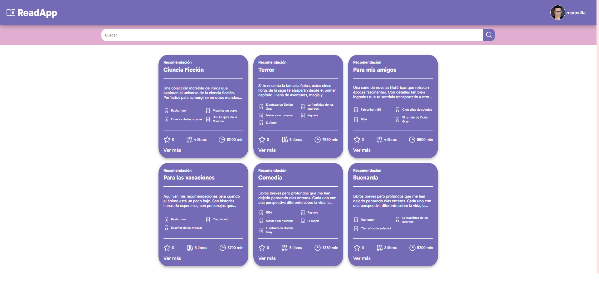
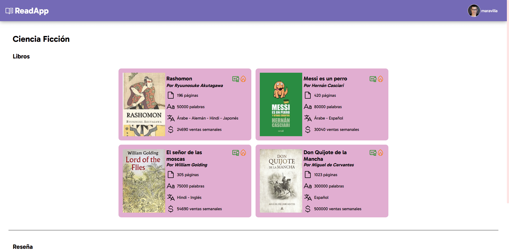

# ReadApp

## Sobre el proyecto

ReadApp es una red social de difusión de libros desarrollada colaborativamente como parte de la materia Algoritmos 3 de la Tecnicatura Universitaria en Programación Informática de la UNSAM. La aplicación se conecta con un [servidor](https://github.com/franncoronel/readapp-backend) Spring Boot desarrollado en el lenguaje de programación Kotlin mediante una RESTful API.

> Debido a los contenidos de la materia, la base de datos se almacena en memoria, no hay una BBDD externa.

## Login
El login es muy sencillo: recibe un nombre de usuario y una contraseña, valida los campos y el botón **Ingresar** dispara la autenticación. Este proceso verifica que el usuario exista en el back-end. 

## Búsqueda principal

## Mis recomendaciones
## Detalle de recomendación:
